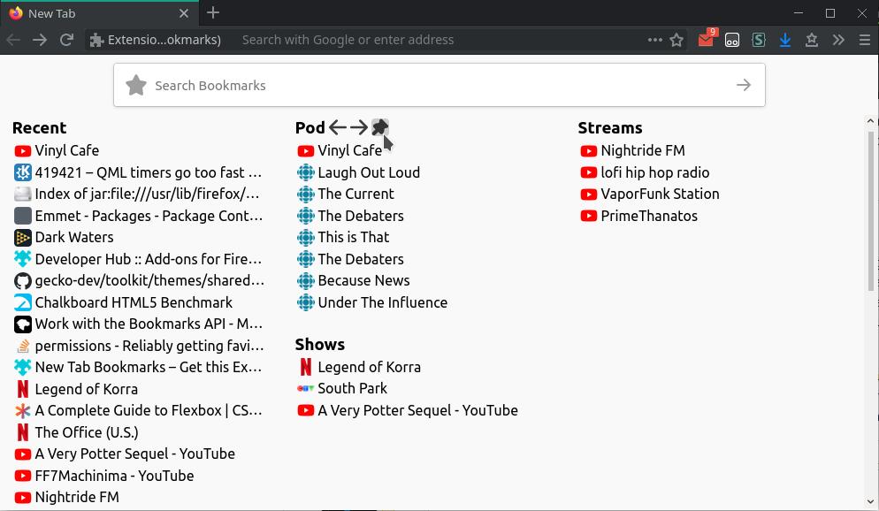
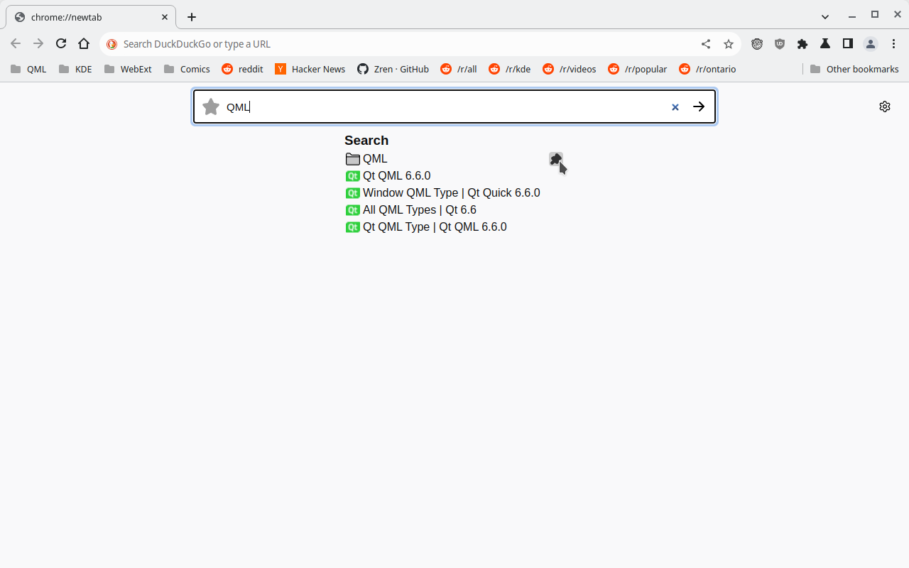
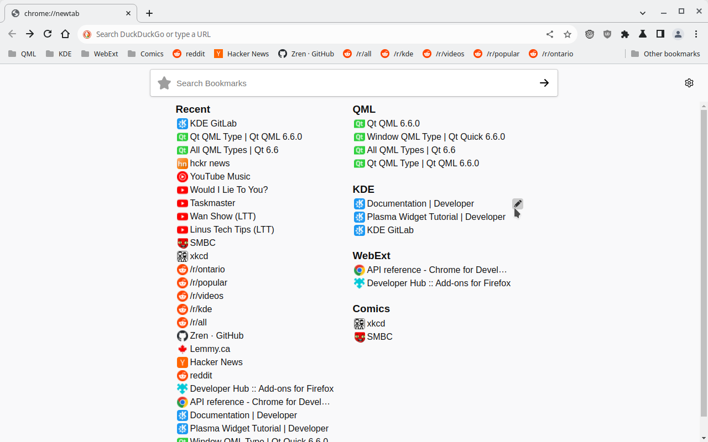
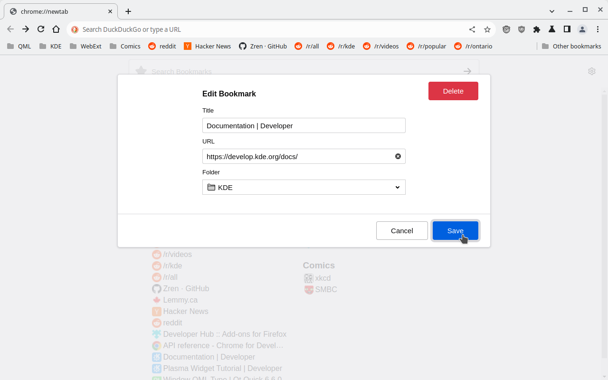
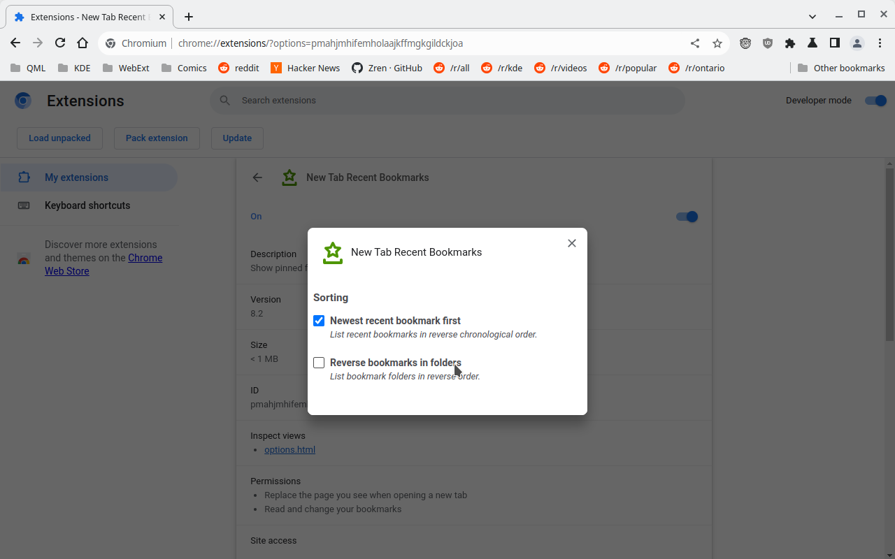

# NewTab Recent Bookmarks

A simple list of the most recent bookmarks, along with the ability to search for a bookmark folder and pin it. Pinned folders display their bookmarks in the descending chronological order as well.

* **Firefox:** https://addons.mozilla.org/en-CA/firefox/addon/new-tab-recent-bookmarks/

## Permissions

* **Chrome:** Favicons are displayed using the favicon cache.
* **Firefox:** Since firefox doesn't expose the favicon cache, the extension needs to do it manually. By using the `tabs` permission, it can store the favicons when you visit a site. Until you have visited a bookmark, a color will be generated for the website based on the hostname.

## Develop / Build

Run `sh ./build.sh` to generate a `firefox.xpi` and a `chrome.crx`.

You can easily load the `src/` as an unpacked addon in Firefox.

To test in Chrome, you will need to modify the `manifest.json` before loading it as an unpacked extension. First run `python3 preparebuild_chrome.py` to modify the `manifest.json`.

Run `git checkout src/manifest.json` to reset the file before commiting changes with it.

## Credits

* Icons are from Firefox.  
  https://github.com/mozilla/gecko-dev/tree/master/browser/themes/shared/icons
* Used the "edit topsite" HTML+CSS from `about:newtab` for the edit bookmark GUI.
    * https://github.com/mozilla/gecko-dev/blob/master/browser/components/newtab/css/activity-stream-linux.css
