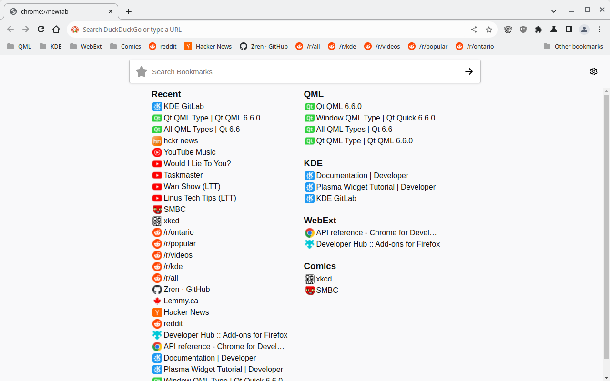

# NewTab Recent Bookmarks

A simple list of the most recent bookmarks, along with the ability to search for a bookmark folder and pin it. Pinned folders display their bookmarks in the descending chronological order as well.

* **Chrome:** Favicons are displayed using the favicon cache.
* **Firefox:** Since firefox doesn't expose the favicon cache, the extension needs to do it manually. By using the `tabs` permission, it can store the favicons when you visit a site. Until you have visited a bookmark, a color will be generated for the website based on the hostname.

## Firefox

## Chrome

You will need to add `"chrome://favicon/""` to `"permissions": [...]` in the `manifest.json` before installing. Run `python3 buildchrome.py` to fix `manifest.json`.

## Credits

* Icons are from Firefox.  
  https://github.com/mozilla/gecko-dev/tree/master/browser/themes/shared/icons
* Used the "edit topsite" HTML+CSS from `about:newtab` for the edit bookmark GUI.
